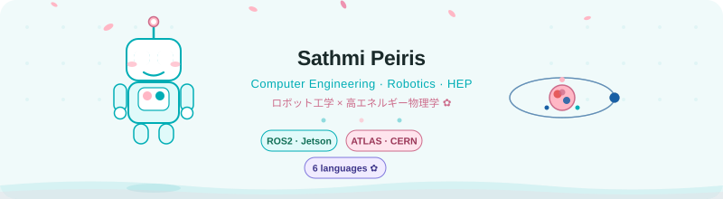

<!-- <h1 align="center">
  
</h1> -->
<div align="center">
  
</div>

<div align="center">
  
  &nbsp;
  
</div>

<br>

<div align="center">

```
✿ ⋆｡°✩  ロボット工学 × 高エネルギー物理学  ✩°｡⋆ ✿
      Robotics  ×  High-Energy Physics
```

</div>

---

### 🤖 About Me ⚛️

I'm a 4th-year **Computer Engineering** undergraduate with a minor in **Data Management**, working at the intersection of autonomous navigation, deep learning, and high-energy physics. When I'm not training neural networks or decoding particle collisions, I'm picking up a new language — currently studying my 6th! *(◕‿◕)✿*

- 🔭 Building a **ROS 2-based Deep Learning framework for Elderly Care** on a Jetson Orin AGX
- ⚛️ Classifying **rare signal processes** using ATLAS Open Data (LHC physics ✨)
- 🌱 Currently diving deeper into **ROOT (CERN)** and **particle physics ML pipelines**
- 🤝 Open to collaborate on **ROS 2 robotics frameworks** and **HEP data analysis**
- 💬 Ask me about **C/C++**, **Python**, or building full-stack apps with the **MERN stack**
- 🌏 Speaks / studying **6 languages** — Sinhala, English, Japanese, Chinese + more!
- ⚡ Fun fact: I debug robots AND decode particle collisions before breakfast `(☞ﾟヮﾟ)☞`

---

### 🛠️ Languages & Tools

<p align="left">
  
  
  
  
  
  
  
</p>

<p align="left">
  
  
  
  
  
  
  
</p>

**Specialisations:**


---

### 📊 GitHub Stats

<div align="center">
  
  &nbsp;
  
</div>

<br>

<div align="center">
  
</div>

---

### 📈 Contribution Graph

<div align="center">
  
</div>

---

### 🐍 Contribution Snake

<div align="center">
  <picture>
    <source media="(prefers-color-scheme: dark)" srcset="https://github.com/sathmipeiris/sathmipeiris/blob/output/github-contribution-grid-snake-dark.svg" />
    <source media="(prefers-color-scheme: light)" srcset="https://github.com/sathmipeiris/sathmipeiris/blob/output/github-contribution-grid-snake.svg" />
    
  </picture>
</div>

> **Note:** To enable the snake animation, create `.github/workflows/snake.yml` in your profile repo — see the workflow file in this repo.

---

### 🌸 A Little More About Me

```python
class SathmiPeiris:

    def __init__(self):
        self.name        = "Sathmi Peiris"
        self.university  = "4th Year · Computer Engineering"
        self.location    = "Sri Lanka 🇱🇰"
        self.languages   = ["Sinhala", "English", "Japanese", "Chinese", "+ 2 more!"]

    @property
    def currently_building(self):
        return [
            "🤖 ROS 2 Deep Learning framework → Elderly Care (Jetson Orin AGX)",
            "⚛️  Rare signal classification → ATLAS Open Data (LHC)",
        ]

    @property
    def interests(self):
        return [
            "Autonomous Navigation", "High-Energy Physics",
            "Full-Stack Development", "Language Learning",
        ]

    def say_hi(self):
        print("Thanks for stopping by! Let's build something amazing ✨")
        print("(◕‿◕)✿  よろしくお願いします！")


me = SathmiPeiris()
me.say_hi()
```

---

### 📫 Connect With Me

<p align="left">
  <a href="https://linkedin.com/in/YOUR-LINKEDIN" target="_blank">
    
  </a>
  &nbsp;
  <a href="mailto:sathmipeiris@gmail.com">
    
  </a>
  &nbsp;
  <a href="https://github.com/sathmipeiris" target="_blank">
    
  </a>
</p>

---

<div align="center">

```
✿ ありがとう for visiting! ✿
      ( ´ ∀ ｀)ﾉ~ ♪
```


</div>
